# Manual de Usuario - Dashboard The Lab Solutions

**Versión:** 1.0  
**Fecha:** 1 de octubre de 2026  
**Aplicación:** Dashboard The Lab Solutions  
**Objetivo:** explicar el uso cotidiano del dashboard sin entrar en administración de servidores, claves ni código.

> IMPORTANTE: las opciones visibles dependen del rol de cada usuario. Si una sección o acción no aparece, no necesariamente es un error: puede estar restringida por permisos.

---

## 1. Cómo usar este manual

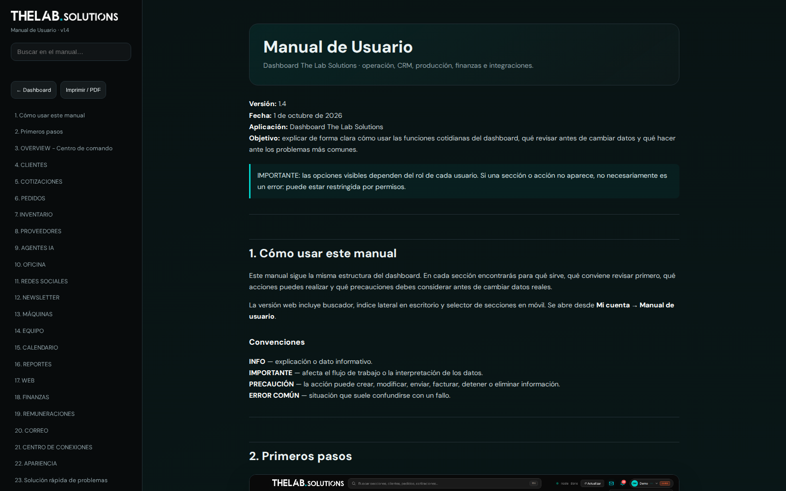

Este manual está organizado por las mismas áreas del dashboard. Para cada sección se explica para qué sirve, qué información estás viendo, qué acciones puedes realizar, qué cambia datos reales y qué errores o confusiones son habituales.

La versión web del manual incluye buscador y navegación lateral. Se abre desde **Mi cuenta -> Manual de usuario**.

### Convenciones

**INFO** - explicación o dato informativo.  
**IMPORTANTE** - afecta el flujo de trabajo o la interpretación de los datos.  
**PRECAUCIÓN** - puede crear, modificar, enviar, facturar, detener o eliminar información.  
**ERROR COMÚN** - situación conocida que suele confundirse con un fallo.

---

## 2. Primeros pasos

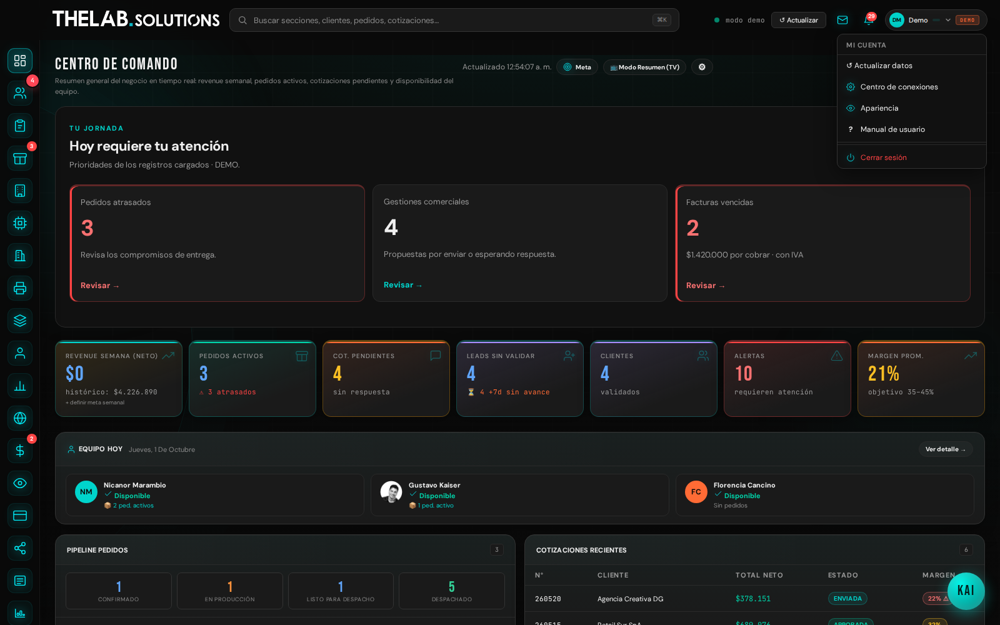

### 2.1 Iniciar sesión

Entra al dashboard con tu usuario habitual. El sistema aplica los permisos asociados a tu rol. No compartas sesiones, tokens ni capturas que muestren credenciales.

### 2.2 Navegación principal

El dock lateral permite entrar a las áreas operativas: Overview, Clientes, Cotizaciones, Pedidos, Inventario, Proveedores, Agentes, Oficina, Redes, Newsletter, Máquinas, Equipo, Calendario, Reportes, Web, Finanzas, Remuneraciones y Correo, según permisos.

En pantallas pequeñas la navegación se adapta al menú móvil.

### 2.3 Buscador superior

Úsalo para localizar rápidamente información sin recorrer todas las secciones. Si el resultado depende de datos recién modificados y no aparece, prueba **Mi cuenta -> Actualizar datos**.

### 2.4 Botón Nuevo

El botón **+ Nuevo** reúne accesos rápidos para crear elementos como leads, clientes, cotizaciones u otros registros permitidos para tu rol.

### 2.5 Notificaciones

La campana superior agrupa avisos y alertas. Puedes filtrar por tipo y consultar el historial. Una notificación no reemplaza el estado real del registro: abre siempre la ficha correspondiente si debes tomar una decisión.

### 2.6 Menú de usuario

Desde tu nombre en la esquina superior puedes acceder a **Actualizar datos**, **Centro de conexiones**, **Apariencia**, **Manual de usuario**, configuraciones técnicas visibles para tu rol y **Cerrar sesión**.

---

## 3. Modos Simple y Experto

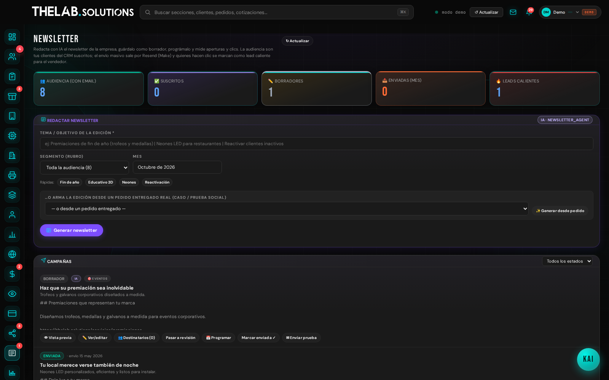

El dashboard ha ido eliminando vistas duplicadas. Actualmente:

- **Solo Simple:** Overview, Calendario, Clientes, Cotizaciones, Pedidos, Máquinas, Equipo y Web.
- **Solo Experto:** Newsletter.
- Otras secciones pueden conservar un selector cuando realmente cambia el nivel de detalle.

**INFO:** Simple no significa "menos datos"; en las secciones anteriores es la vista canónica y contiene las mismas acciones útiles sin duplicar interfaz.

---

## 4. OVERVIEW - Centro de comando

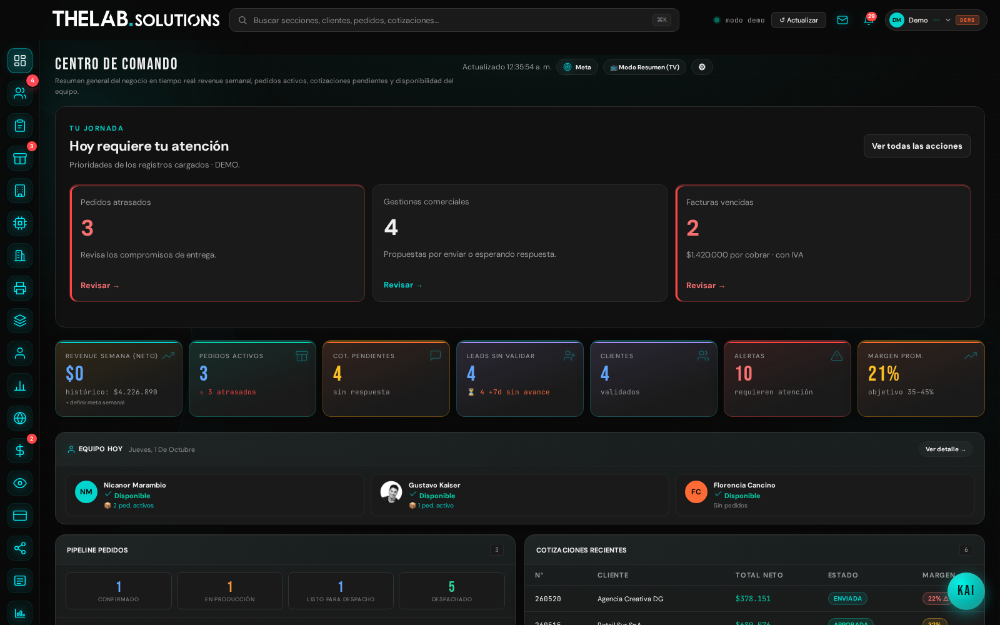

### Para qué sirve

Overview resume la operación actual: ventas, pedidos, cotizaciones, clientes, alertas y compromisos.

### Qué revisar primero

1. Revenue de la semana y del mes.
2. Pedidos activos.
3. Cotizaciones pendientes.
4. Clientes / leads.
5. Alertas.
6. Margen promedio.
7. Hoy requiere tu atención.

### KPIs

Los KPIs son accesos de lectura rápida. Si un KPI no coincide con una ficha concreta, abre la sección de origen antes de modificar datos.

### Hoy requiere tu atención

Agrupa situaciones operativas que requieren acción: entregas, gestiones comerciales, cobros u otros bloqueos detectados.

**IMPORTANTE:** una alerta derivada de datos históricos o estimados debe revisarse contra su fuente. Por ejemplo, Finanzas distingue actualmente entre cartera viva y registros históricos.

### Modo Resumen TV

**Modo Resumen (TV)** está pensado para una pantalla visible en la oficina. No reemplaza la navegación normal.

---

## 5. CLIENTES

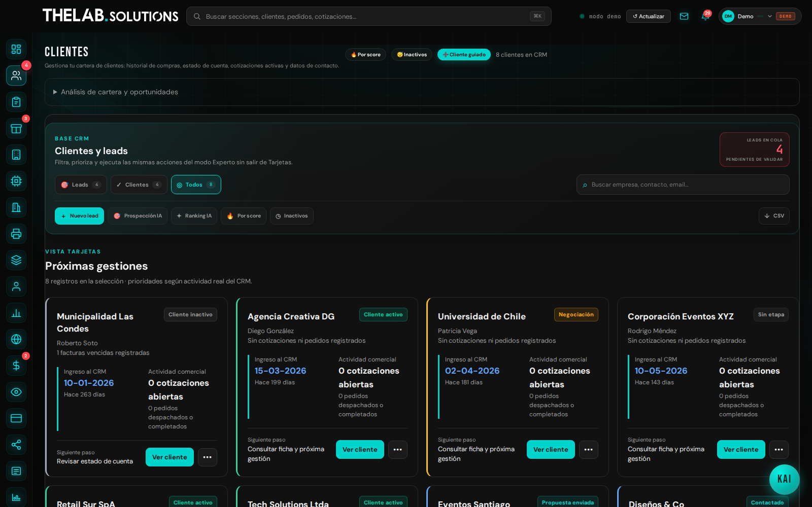

### Para qué sirve

Centraliza clientes, leads, datos de contacto, estado comercial e historial relacionado.

### Acciones principales

- Crear **Nuevo Lead / Cliente**.
- Crear cliente mediante flujo guiado.
- Filtrar por score o inactividad.
- Validar leads como clientes.
- Revisar relaciones con cotizaciones y pedidos.
- Exportar CSV cuando corresponda.

### Flujo recomendado

1. Buscar primero al cliente para evitar duplicados.
2. Si no existe, crearlo.
3. Completar empresa, contacto, correo, teléfono y origen.
4. Mantener actualizado el estado comercial.
5. Crear la cotización desde el cliente cuando sea posible.

### ERROR COMÚN - clientes duplicados

Un mismo cliente puede existir más de una vez si históricamente fue creado con nombres distintos. Antes de crear otro, busca por **empresa, RUT, email y contacto**.

**PRECAUCIÓN:** no elimines un cliente solo porque parece duplicado si tiene cotizaciones o pedidos relacionados. Primero revisa sus vínculos.

---

## 6. COTIZACIONES

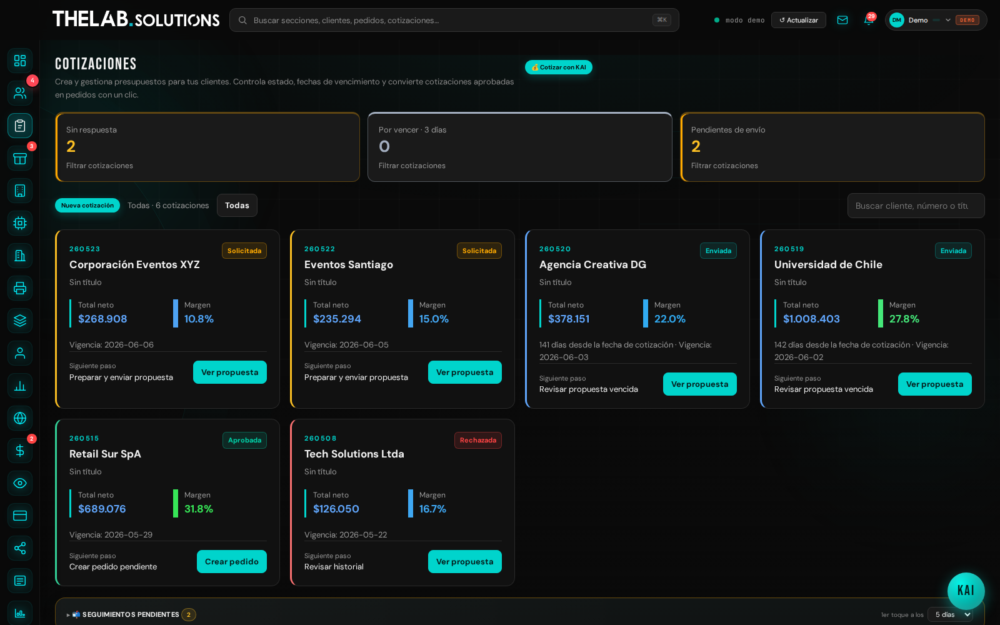

### Para qué sirve

Crear, calcular, revisar, enviar y aprobar propuestas comerciales.

### Estados habituales

Según el flujo disponible, una cotización puede pasar por estados como borrador, enviada, aprobada o rechazada.

### Crear una cotización

1. Pulsa **Nueva cotización**.
2. Selecciona o crea el cliente.
3. Agrega los ítems.
4. Completa cantidad, costos y precio de venta.
5. Revisa el margen.
6. Define plazo por días o fecha fija.
7. Agrega observaciones si corresponde.
8. Guarda.

### Herramientas

La cotización puede incluir catálogo, cotización asistida con KAI, calculadora 3D, calculadora Láser, calculadora Neón y consulta de cotizaciones anteriores.

### Ítems y observaciones

Los ítems se pueden reorganizar. Las observaciones deben describir condiciones relevantes y no sustituir campos estructurados como cantidades, precio o plazo.

### Aprobar

Al aprobar una cotización, el flujo normal debe relacionarla con un pedido. Si una venta es histórica y ya fue producida/pagada, puede estar marcada como **venta histórica conciliada** para evitar crear un pedido nuevo.

**PRECAUCIÓN:** no cambies una cotización histórica a Aprobada solo para corregir su apariencia si eso puede crear un pedido nuevo o alterar revenue. Primero verifica si la operación ya existe.

### Ver propuesta

La vista de propuesta permite revisar descripción, unidades, costos y valores de venta antes de compartir o aprobar.

---

## 7. PEDIDOS

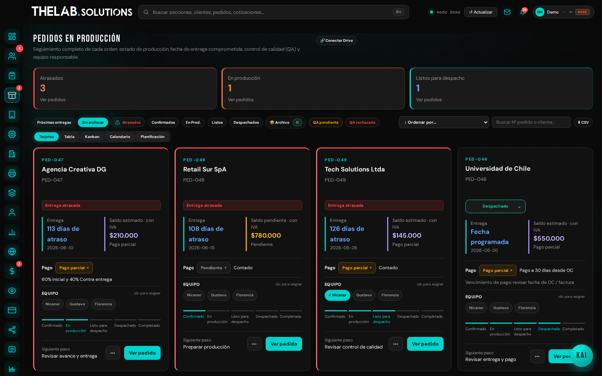

### Para qué sirve

Controlar el ciclo posterior a una venta aprobada: producción, pagos, equipo, despacho, QA y documentación.

### Vistas disponibles

- Tarjetas
- Tabla
- Kanban
- Calendario
- Planificación

Estas vistas cambian la forma de trabajar con los mismos pedidos.

### Estados

El flujo operativo incluye estados como Confirmado, En producción, Listo para despacho, Despachado, Completado y Cancelado.

### Estado de pago

Las tarjetas y tabla permiten representar situaciones como Abono, Saldo, Total y Pago a 30 días. El estado de pago y el estado de producción son conceptos distintos.

### Equipo

Las etiquetas de equipo indican responsables. Mantén esta información actualizada para que el calendario, la planificación y los informes tengan contexto correcto.

### Google Drive

El botón de Drive debe mostrar **Drive conectado** cuando OAuth esté autorizado. Puedes conectar desde Pedidos o desde el Centro de Conexiones.

**ERROR COMÚN:** si Centro de Conexiones muestra Drive verde pero Pedidos dice conectar, haz una recarga dura. El estado visual está diseñado para sincronizarse entre secciones.

### QA y despacho

No marques un pedido como despachado solo para sacarlo de la lista. Usa QA y los estados correspondientes para que el historial mantenga significado.

---

## 8. INVENTARIO

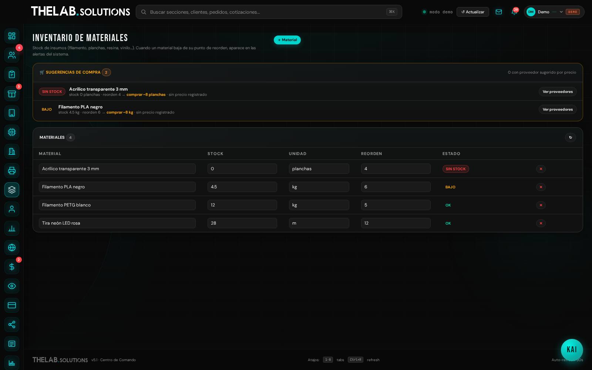

### Para qué sirve

Registrar materiales y consultar stock operativo.

### Acciones habituales

- Crear material.
- Actualizar cantidades.
- Revisar alertas o stock bajo.
- Relacionar consumos con producción cuando el flujo lo permita.
- Exportar o revisar movimientos según disponibilidad.

**IMPORTANTE:** el stock del dashboard debe representar una fuente compartida. No uses notas personales como sustituto de movimientos de inventario.

---

## 9. PROVEEDORES

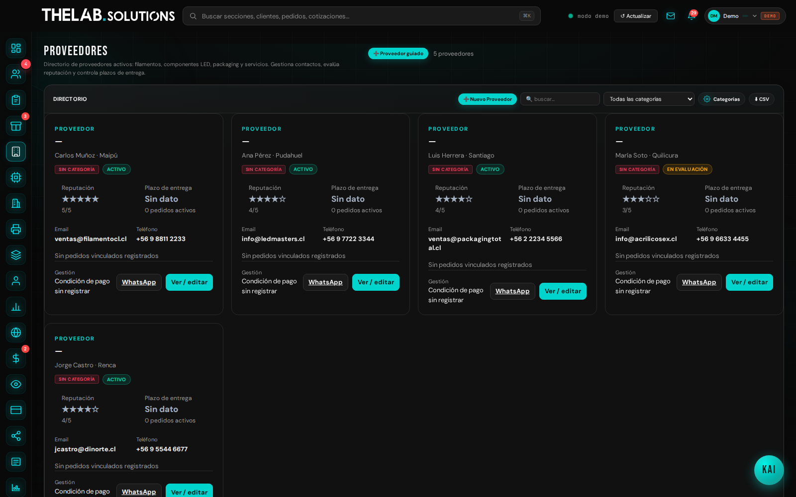

### Para qué sirve

Gestionar proveedores, categorías, precios y apoyo al proceso de compra.

### Acciones

- Nuevo proveedor.
- Proveedor guiado.
- Filtrar por categorías.
- Buscar proveedores.
- Exportar CSV.
- Mantener datos de contacto y condiciones.

### Buenas prácticas

Evita duplicar proveedores por diferencias de escritura. Registra condiciones de compra en campos estructurados cuando existan y verifica vigencia de precios antes de cotizar si el valor es antiguo.

---

## 10. AGENTES IA

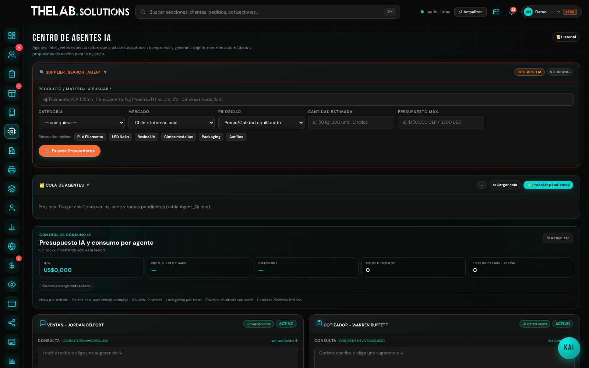

### Para qué sirve

Ejecutar asistentes especializados para tareas concretas del negocio: análisis, redacción, reportes, búsqueda u otras automatizaciones.

### Uso recomendado

1. Usa primero los datos del dashboard.
2. Ejecuta el agente solo cuando aporte análisis o generación.
3. Revisa el resultado antes de aplicarlo.
4. No asumas que un texto de IA es un dato confirmado del CRM.

### Cola de agentes

La cola permite revisar trabajos pendientes y resultados. Un agente no debe modificar silenciosamente un proceso crítico sin confirmación cuando la acción requiere aprobación humana.

### Costos

El dashboard contiene controles de gasto para Claude/OpenAI. Evita regenerar el mismo análisis repetidamente si los datos no cambiaron.

---

## 11. OFICINA

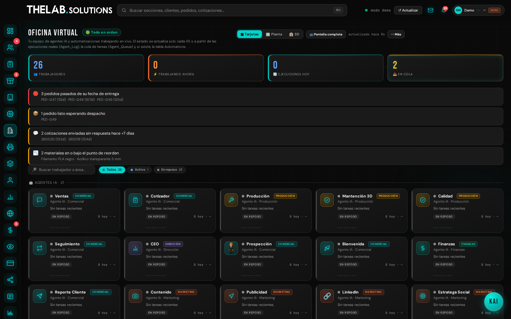

### Para qué sirve

Dar una representación operativa del día: agentes, automatizaciones, impresoras y bloqueos.

### Vistas

Puede incluir tarjetas, planta, vista 3D, zoom, densidad, escena, resumen diario y pantalla completa.

### Uso correcto

La Oficina es una visualización de operación, no una fuente independiente. Si un elemento parece detenido, abre la sección que origina ese estado.

---

## 12. REDES SOCIALES

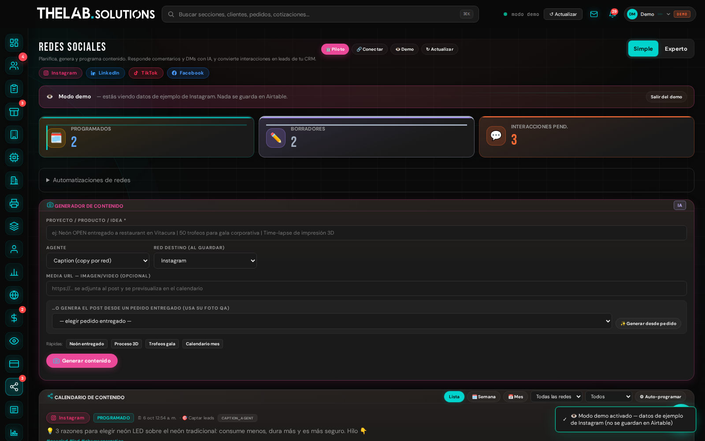

### Para qué sirve

Planificar contenido, generar ideas, organizar publicaciones y revisar métricas cuando las integraciones estén disponibles.

### Acciones visibles

- Generar contenido.
- Generar desde pedido.
- Planificar por semana o mes.
- Auto-programar.
- Sugerir pendientes.
- Reporte semanal IA.
- Mejor horario.
- Crear UTM.
- Actualizar métricas.

**PRECAUCIÓN:** generar contenido no significa publicarlo. Cuando una integración externa no está conectada, algunas acciones pueden quedar como planificación o cola.

---

## 13. NEWSLETTER - solo modo Experto

### Para qué sirve

Gestionar campañas de email masivo separadas del correo individual 1:1.

### Bloques principales

- KPIs de audiencia y campañas.
- Redacción de newsletter.
- Campañas.
- Leads calientes.
- Audiencia por rubro.

### Flujo recomendado

1. Define objetivo y segmento.
2. Genera o redacta el contenido.
3. Revisa asunto, preheader y cuerpo.
4. Guarda borrador.
5. Usa **Vista previa**.
6. Pasa a revisión.
7. Programa o envía una prueba.
8. Solo después habilita el envío real.

### Estados

Borrador -> En revisión -> Programada -> Enviada.

### Audiencia

La audiencia proviene del CRM. Las bajas y el consentimiento deben respetarse.

### Leads calientes

Aperturas/clics pueden generar oportunidades de seguimiento. Revisa el contexto antes de convertir una señal de engagement en una acción comercial.

**PRECAUCIÓN:** Newsletter es comunicación 1:N. No lo uses para reemplazar conversaciones individuales desde Correo.

---

## 14. MÁQUINAS

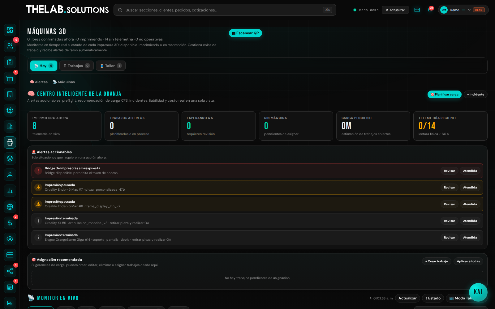

### Para qué sirve

Supervisar la granja 3D, cámaras, telemetría, trabajos, calibración y operación remota.

### Qué muestra cada impresora

Según disponibilidad: estado, cámara, temperaturas, telemetría, archivo/trabajo, progreso, información de cama, alertas y acciones remotas.

### Controles remotos

Pueden existir acciones para pausar, reanudar, detener, mover ejes, ajustar temperatura, recuperar telemetría y calibrar.

**PRECAUCIÓN:** detener, mover o cambiar temperatura actúa sobre una máquina real. Verifica siempre impresora y trabajo antes de ejecutar.

### Calibración automática

La secuencia de calibración incluye homing y nueva malla de cama. Durante la medición, el estado debe interpretarse como calibración en curso y no como "sin malla" definitiva.

### Impresión sin trabajo asignado

Si el dashboard detecta una impresión sin trabajo relacionado, muestra una alerta global para asignarla a un trabajo o saltar esa impresión.

### Modo Taller TV

Muestra impresoras y cámaras para supervisión del taller.

### Centro de planificación

Distingue entre planificación local, telemetría física reciente y cola durable confirmada por Farm Controller.

**IMPORTANTE:** "Lista para iniciar" no significa necesariamente que el archivo ya esté en una cola física de ejecución.

---

## 15. EQUIPO - solo modo Simple

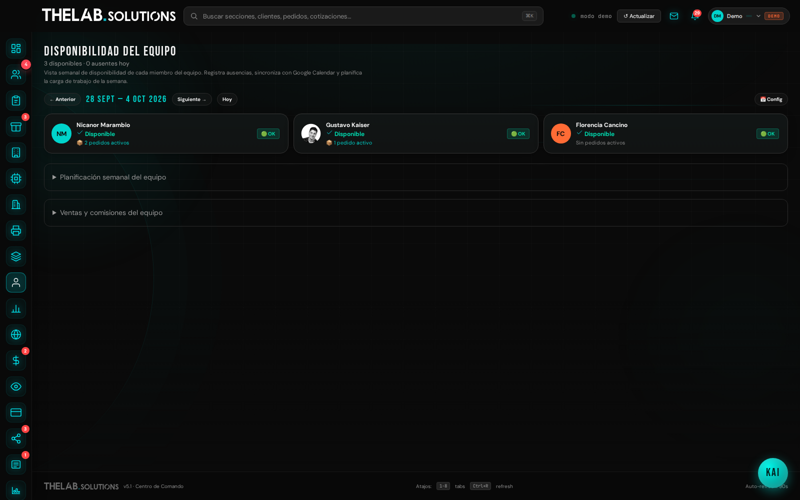

### Para qué sirve

Gestionar personas, agenda, metas, comisiones y elementos operativos asociados al equipo.

### Acciones habituales

- Revisar agenda.
- Sincronizar.
- Configurar.
- Revisar comisión.
- Revisar metas.
- Guardar cambios.
- Consultar información asociada.

El antiguo modo Experto fue retirado porque duplicaba la información del modo Simple.

---

## 16. CALENDARIO - solo modo Simple

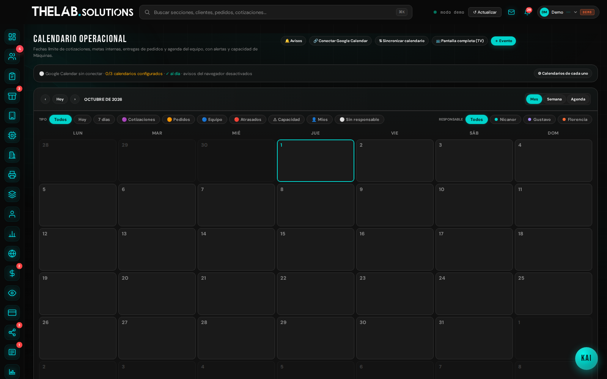

### Para qué sirve

Coordinar eventos, entregas y compromisos del equipo.

### Vistas

- Mes
- Semana
- Agenda

### Acciones

Crear, editar o eliminar eventos; asignar personas; definir lugar, notas y horarios; conectar Google Calendar; sincronizar; activar avisos; seleccionar calendarios y usar pantalla completa TV.

### Conectar vs sincronizar

**Conectar Google Calendar** autoriza tu sesión OAuth.  
**Sincronizar calendario** empuja o concilia eventos pendientes entre el dashboard y Google Calendar.

### Pantalla completa TV

Muestra únicamente el calendario, pensada para monitor compartido.

---

## 17. REPORTES

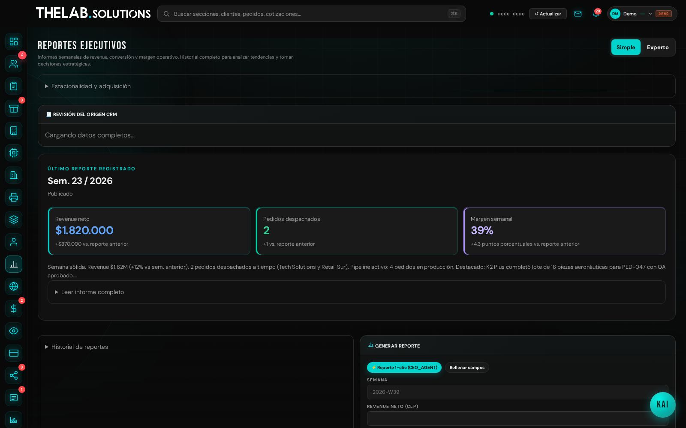

### Para qué sirve

Generar y consultar resúmenes ejecutivos basados en la información del negocio.

### Reporte CEO

El **Reporte 1-clic (CEO_AGENT)** analiza los datos disponibles y genera una lectura ejecutiva.

### Uso correcto

Verifica que los datos base estén actualizados. Distingue entre cifras calculadas y texto interpretativo generado por IA. Si un informe antiguo no coincide con el estado actual, genera uno nuevo. No corrijas el CRM editando un informe; corrige la fuente.

---

## 18. WEB - solo modo Simple

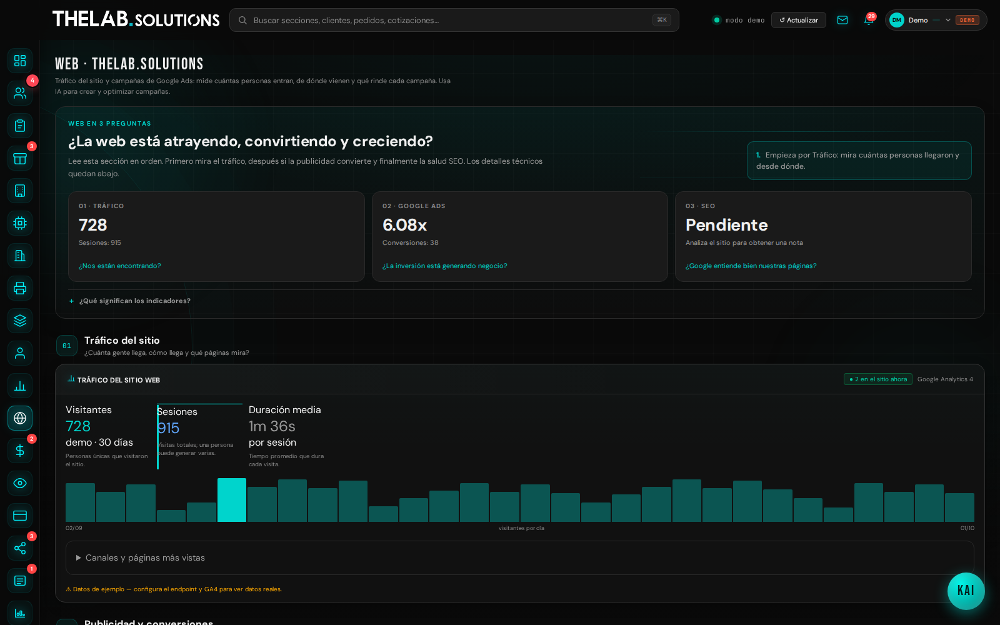

### Para qué sirve

Revisar sitio web, SEO, Google Ads, métricas y herramientas de optimización.

### Acciones

Según configuración: analizar sitio, optimizar con IA, configurar integraciones, crear contenido con IA, revisar campañas, conversiones offline, tope de gasto, verificar cambios, diagnosticar y exportar CSV.

### Google Ads

Algunas acciones dependen de Apps Script o APIs externas. Una conexión verde confirma la prueba configurada, pero no implica que todas las mutaciones estén disponibles.

**PRECAUCIÓN:** las herramientas de optimización o campañas pueden afectar gasto real. Revisa presupuesto, cuenta y acción antes de ejecutar cambios.

---

## 19. FINANZAS

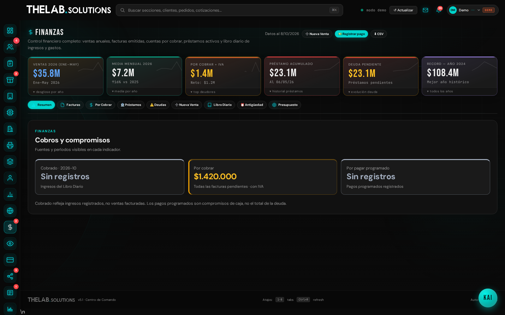

### Para qué sirve

Consultar ventas, facturas, cobranza, préstamos, deudas, libro diario, antigüedad y presupuesto.

### Pestañas principales

- Resumen
- Facturas
- Por Cobrar
- Préstamos
- Deudas
- Nueva Venta
- Libro Diario
- Antigüedad
- Presupuesto

### Revenue, facturación y pago no son lo mismo

- **Revenue / venta:** valor comercial reconocido por el flujo correspondiente.
- **Factura:** documento emitido.
- **Pago:** dinero recibido.
- **Por cobrar:** saldo vivo pendiente.

No asumas que una venta aprobada implica automáticamente que está facturada y pagada.

### Por Cobrar

La cartera activa utiliza una ruta conciliada. Los registros históricos embebidos no deben generar cobranza por sí solos sin confirmación.

### Tramos de aging

- Por vencer / hoy
- Vencidas 1-30 días
- 31-60 días
- Más de 60 días

### ERROR COMÚN - deuda histórica falsa

Si aparece una factura antigua como morosa y sabes que fue pagada, no envíes una cobranza inmediatamente. Revisa primero su fuente, estado de pago y si existe una factura viva en Airtable.

### Facturas / SII

Cuando la emisión tributaria esté habilitada, verifica folio y respuesta SII. No re-emitas automáticamente ante una respuesta incierta; confirma estado antes de intentar de nuevo.

---

## 20. REMUNERACIONES

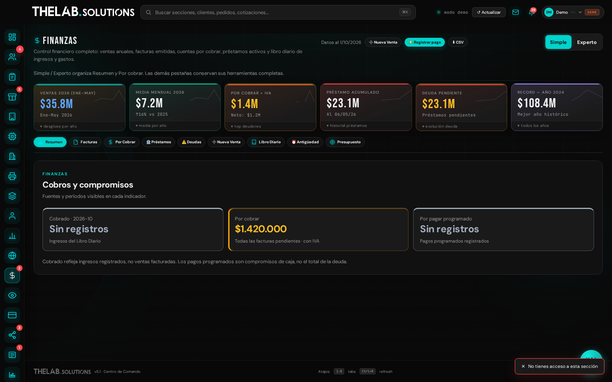

### Para qué sirve

Consultar remuneraciones, periodos y configuraciones relacionadas con personas y comisiones.

### Filtros

Todo, Este año, Este mes, Mes anterior y Esta semana.

### Acciones

Exportar CSV, configurar sueldos y guardar sueldos.

**PRECAUCIÓN:** los cambios de sueldo o comisión afectan cálculos posteriores. Confirma persona y vigencia antes de guardar.

---

## 21. CORREO

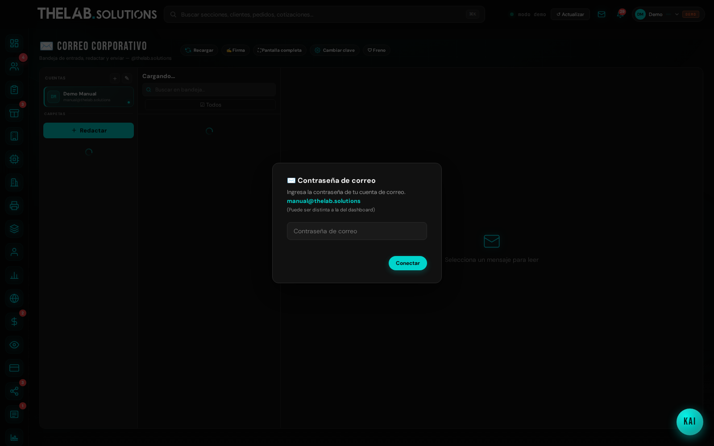

### Para qué sirve

Trabajar con las casillas autorizadas desde una bandeja integrada.

### Navegación

La sección organiza carpetas, mensajes, lectura, redacción, no deseado, navegación y firmas.

### Redactar

El editor soporta composición normal, saltos de línea y corrección ortográfica del navegador.

### Hilos

Los mensajes relacionados deben agruparse para facilitar seguimiento.

### No deseado

Marcar como no deseado debe persistir; si el mensaje vuelve a Bandeja de entrada, verifica conexión y estado de sincronización.

### Recompras

Abrir una sugerencia de recompra no debe eliminarla. Se considera atendida cuando el flujo detecta una acción real como envío por correo o WhatsApp.

### Resend e IMAP

- **IMAP** permite autenticar y leer la casilla.
- **Resend** se usa para salida cuando corresponde.

Centro de Conexiones comprueba ambos sin exponer claves.

**PRECAUCIÓN:** no compartas contraseñas IMAP, API keys ni capturas del menú técnico.

---

## 22. CENTRO DE CONEXIONES

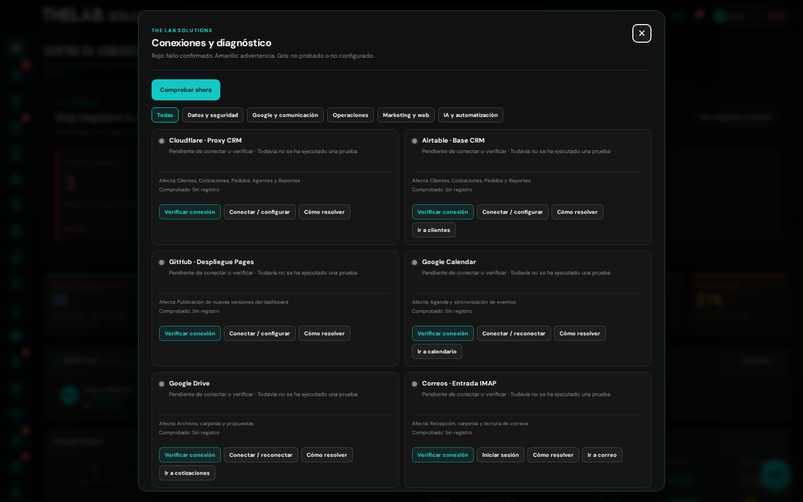

### Dónde está

**Mi cuenta -> Centro de conexiones**

### Para qué sirve

Comprobar si las integraciones necesarias para el dashboard están realmente operativas.

### Estados

- **Verde:** prueba satisfactoria.
- **Amarillo:** configuración parcial, condición temporal o verificación incompleta.
- **Rojo:** error de autenticación, acceso o servicio.
- **Gris:** no configurado / sin evidencia suficiente.

### Conectar vs Verificar

**Conectar / configurar** inicia la autorización o abre la configuración necesaria.  
**Verificar conexión** ejecuta una prueba de bajo impacto.

### Integraciones típicas

Airtable / Proxy CRM, Google Drive, Google Calendar, IMAP, Resend, Claude, OpenAI, Make, Google Ads, bridge de impresoras y otras integraciones habilitadas.

### Qué hacer ante un amarillo

Lee el texto del diagnóstico. No amplíes permisos de una API solo para que el monitor quede verde si la integración funciona con permisos mínimos.

### Qué hacer ante un rojo

1. Abre el detalle.
2. Identifica si es credencial, red, permiso o servicio.
3. Corrige únicamente esa integración.
4. Vuelve a verificar.

---

## 23. APARIENCIA

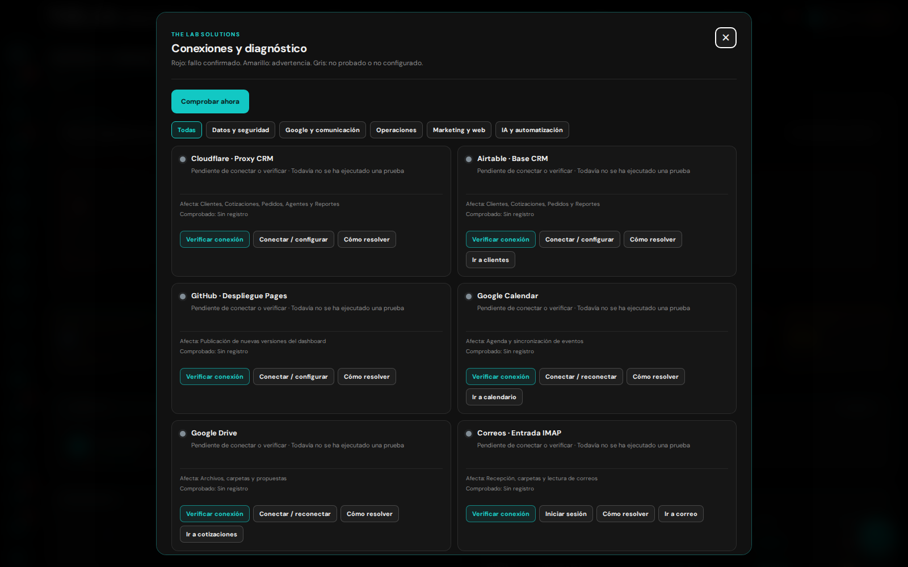

### Dónde está

**Mi cuenta -> Apariencia**

### Tema

- Oscuro
- Claro

### Fondos

- Blueprint Grid
- Holographic
- Glass Panels

### Fuentes

- DM Sans
- Inter
- Space Grotesk

Los números grandes de KPIs conservan una tipografía numérica estable para evitar deformación al cambiar la fuente general.

### Persistencia

La preferencia se guarda en el navegador. Cambiar apariencia no modifica CRM, pedidos ni datos compartidos.

---

## 24. Solución rápida de problemas

### "No veo los cambios que acabamos de publicar"

Haz una recarga dura: macOS **Command + Shift + R**; Windows **Ctrl + Shift + R**.

### "Los datos parecen antiguos"

1. Mi cuenta -> Actualizar datos.
2. Revisa el Centro de Conexiones.
3. Abre la sección de origen.
4. Si el problema persiste, evita modificar registros a ciegas.

### "Drive sigue diciendo Conectar"

Comprueba Drive en Centro de Conexiones. Si queda verde, recarga el dashboard y vuelve a Pedidos.

### "Una cotización aprobada no aparece en Pedidos"

Busca el pedido por cliente y número. Si no existe, revisa si se trata de una venta histórica conciliada antes de crear un pedido nuevo.

### "Una impresora está trabajando pero aparece offline"

Comprueba telemetría y bridge. Una máquina puede seguir imprimiendo con Klipper aunque Moonraker/telemetría estén caídos.

### "Correo no envía"

Verifica IMAP y Resend en Centro de Conexiones. IMAP verde y Resend rojo/amarillo indican problemas distintos.

### "Finanzas muestra una deuda que creo pagada"

No envíes cobranza aún. Revisa factura, pago y fuente. El historial antiguo no debe tratarse automáticamente como deuda viva.

### "Un KPI parece incorrecto"

Abre la sección fuente y compara el conjunto de registros. Reporta el KPI junto con el dato real esperado y el periodo.

---

## 25. Buenas prácticas operativas

1. Buscar antes de crear para evitar duplicados.
2. Actualizar estados reales, no estados "para ordenar la pantalla".
3. No borrar históricos sin revisar vínculos.
4. No usar IA como fuente de verdad.
5. No compartir credenciales por chat o capturas.
6. Comprobar conexiones antes de asumir que faltan datos.
7. Distinguir planificación de ejecución física.
8. Distinguir venta, factura y pago.
9. Usar QA antes de cerrar producción.
10. Mantener fechas de entrega y responsables actualizados.

---

## 26. Glosario

### Airtable
Base de datos principal utilizada por múltiples módulos del dashboard.

### CRM
Conjunto de clientes, leads, cotizaciones, pedidos e historial comercial.

### Revenue
Valor de ventas utilizado por los indicadores comerciales. Su definición puede depender de la fuente y periodo del módulo.

### Margen
Diferencia relativa entre costo y valor de venta.

### Neto
Monto antes de IVA.

### IVA
Impuesto al Valor Agregado aplicado según corresponda.

### DTE
Documento Tributario Electrónico.

### QA
Control de calidad antes de despacho o cierre.

### IMAP
Protocolo utilizado para acceder a una casilla de correo.

### Resend
Proveedor utilizado para determinados envíos de correo.

### OAuth
Autorización usada por servicios como Google Drive y Google Calendar.

### Bridge
Servicio intermedio que permite al dashboard comunicarse con las impresoras.

### Moonraker
API habitual de Klipper utilizada para consultar/controlar impresoras compatibles.

### Farm Controller
Componente que mantiene una cola durable de ejecución de impresión.

### CFS
Sistema de alimentación de filamento en máquinas compatibles.

### Trabajo
Unidad de producción/impresión planificada.

### Pedido
Orden comercial/operativa derivada de una venta.

### Cotización
Propuesta comercial previa al pedido.

### Lead
Contacto u oportunidad todavía en proceso comercial.

### Venta histórica conciliada
Operación antigua ya cerrada que se registra como aprobada sin volver a crear pedidos o revenue actuales.

---

## 27. Qué hacer cuando encuentras un error

Al reportar un problema, entrega:

1. sección;
2. registro afectado;
3. qué esperabas ver;
4. qué aparece realmente;
5. captura;
6. si acababas de crear/editar algo;
7. si Centro de Conexiones estaba verde;
8. hora aproximada.

Esto permite distinguir rápidamente entre un problema de interfaz, caché, datos, permisos o integración.

---

## 28. Control de versión del manual

Este documento vive dentro del mismo repositorio del dashboard en `docs/manual/MANUAL_USUARIO.md`.

La versión web se publica como `manual.html`.

Cuando una sección cambia de forma significativa, el manual debe actualizarse en el mismo PR o en un PR inmediatamente posterior.
